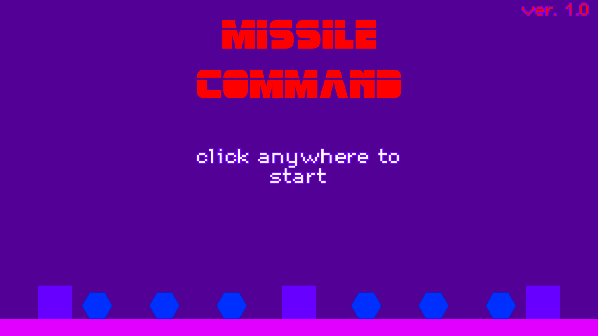

 

  

  

  <h2 align="center"> A r k a n o i d </h2>

  

    A clone of original Arkanoid Game!
     
    <a href="https://github.com/MistycznyArbuz/Arkanoid/wiki"><strong>Explore the docs »</strong></a>
     
     
    <a href="https://github.com/MistycznyArbuz/Arkanoid/releases/latest">Download Latest Release</a>
    ·
    <a href="https://github.com/MistycznyArbuz/Arkanoid/blob/main/Bug-template.md&template=Bug-report.md">Report Bug</a>
    ·
    <a href="https://github.com/othneildrew/Best-README-Template/issues/new?labels=enhancement&template=feature-request---.md">Request Feature</a>
  

This is my own version of A r k a n o i d
