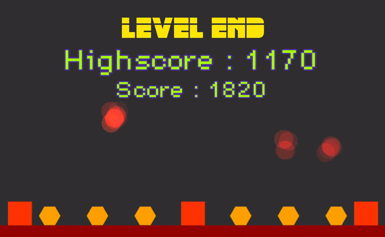

 

  

  

  <h1 align="center"> M i s s l e C o m m a n d </h1>

  

    A clone of original Missle Command Game!
     
    <a href="https://github.com/MistycznyArbuz/Arkanoid/wiki"><strong>Explore the docs »</strong></a>
     
     
    <a href="https://github.com/MistycznyArbuz/Arkanoid/releases/latest">Download Latest Release</a>
    ·
    <a href="https://github.com/MistycznyArbuz/Arkanoid/issues/new?labels=bug&template=Bug-report---.md">Report Issue</a>
  

  <h2 align="left"> About </h2>

  

    This is one of my first commerial projects, created <b> ~2 years ago. </b> 
      It was published on Google Play store, but I decided to remove it from there and publish on GitHub!
  

  <h2 align="left"> Gameplay </h2>

  

  

    Gameplay is as simple as in the original version of the game. 
      Main objective of the player is to protect friendly buildings from enemy missles.
      The game becomes harder, and harder and player can beat own high score.
  

